# 《薯安智检农业病害识别平台使用说明》

> 文档版本：v0.6.0  
> 适用系统：薯安智检农业病害识别平台当前主线  
> 默认部署环境：Windows Server 轻量云服务器、SQLite、FastAPI、Vue、Caddy、NSSM

## 目录

| 章节 | 内容 | 建议读者 |
|------|------|----------|
| 第1章 | 文档说明 | 所有人 |
| 第2章 | 项目概述 | 维护者、演示人员、二次开发人员 |
| 第3章 | 源码获取与本地准备 | 部署人员、开发者 |
| 第4章 | 快速部署与开始使用 | 演示人员、开发者 |
| 第5章 | 环境变量配置 | 部署人员、维护者 |
| 第6章 | Windows Server 服务器部署 | 系统管理员、部署人员 |
| 第7章 | 管理端使用说明 | 平台维护者 |
| 第8章 | 用户端使用说明 | 普通用户、演示人员 |
| 第9章 | 主要接口说明 | 二次开发人员 |
| 第10章 | 常见问题与排查 | 所有人 |
| 第11章 | 当前限制与后续规划 | 项目负责人、维护者 |
| 第12章 | 附录 | 部署人员、开发者 |
| 第13章 | 场景化操作手册 | 演示人员、普通用户、维护者 |
| 第14章 | 服务器交付与运维规范 | 系统管理员、项目负责人 |

---

## 1. 文档说明

### 1.1 文档目的

本手册用于指导用户完成薯安智检农业病害识别平台的源码获取、本地运行、服务器部署、管理员配置、普通用户使用、常见问题排查等工作。所有操作说明均基于仓库当前主线代码，确保读者能够快速上手并独立完成平台的搭建与使用。

### 1.2 适用对象

本手册适用于以下六类人员：

| 角色 | 主要阅读章节 |
|------|-------------|
| **平台维护者** | 第7章（管理端）、第11章（限制与规划） |
| **系统管理员/部署人员** | 第3–6章（源码获取、部署）、第12章（附录） |
| **普通识别用户** | 第8章（用户端使用说明） |
| **项目演示人员** | 第4章（快速部署）、第6章（服务器部署）、第10章（排查） |
| **二次开发人员** | 第5章（环境变量）、第9章（接口说明）、第12章（附录） |

### 1.3 项目版本与当前状态

当前项目基线为 **v0.6.0 streaming WebUI baseline**。仓库 README 已明确以下几点：

- 旧版本地 CNN、`final_model.h5`、Notebook、Colab、Kaggle/PlantVillage 训练资料已转为 **legacy 资料**，不参与新系统主线。
- 当前后端入口为 `backend/app/main.py`，前端入口为 `frontend/src/main.js`。
- 识别、建议和问答均通过后端统一配置的 **通用模型 Provider** 完成，采用 OpenAI-compatible `chat/completions` 调用层。
- 不再使用本地 CNN 作为主线，不在服务器上训练模型，也不运行本地大模型。
- 普通用户不在前端配置 API Key；模型 API 由平台维护者在后端管理页统一配置、统一承担、统一测试。

---

## 2. 项目概述

### 2.1 项目简介

“薯安智检”是面向马铃薯病虫害场景的 AI 识别与防治建议平台。平台将外部大模型能力、安全的后台模型配置、用户会话历史、天气位置上下文和可部署的 WebUI 整合为一个轻量演示平台，帮助农业从业者快速识别马铃薯病害并获取防治建议。

### 2.2 核心功能

平台提供以下核心功能：

1. **图片病害识别**：上传马铃薯病害图片，调用外部多模态大模型返回疾病名称、风险等级、置信度、防治建议等信息。
2. **AI 防治建议生成**：根据识别结果和天气、位置上下文，生成针对性的防治建议。
3. **网页 AI 助手**：支持马铃薯病害相关问题的文本对话，提供 Markdown 渲染和流式回复。
4. **识别历史记录**：登录用户可查看和管理历史识别记录。
5. **用户注册登录**：支持账号注册、登录、资料修改、头像上传和密码修改。
6. **管理员统一配置模型 Provider**：在后台管理页配置通用 Provider，API Key 加密存储，不向前端暴露明文。

### 2.3 系统角色划分

系统按职责划分为三类角色：

| 角色 | 权限与职责 |
|------|-----------|
| **普通用户** | 注册登录、上传图片、查看识别结果、使用 AI 助手、查看和管理历史记录 |
| **管理员/维护者** | 配置通用模型 Provider、测试模型连接、维护系统运行 |
| **部署人员/开发者** | 克隆源码、配置环境变量、启动前后端、部署到 Windows Server、NSSM 服务注册 |

### 2.4 系统总体架构

系统由以下组件构成：

- **前端**：Vue + Vite + JavaScript，提供 ChatGPT 风格对话页面、侧边栏、图片拖拽上传、天气定位等功能。
- **后端**：FastAPI + Uvicorn，提供 REST API 和 SSE 流式接口，入口为 `backend/app/main.py`。
- **数据库**：默认使用 SQLite（文件路径 `backend/sazj.sqlite3`），通过 SQLAlchemy ORM 操作，开发阶段通过 `create_all` 自动建表。
- **外部模型**：OpenAI-compatible `chat/completions` 调用层，支持 Kimi/Moonshot 兼容路径适配。
- **部署组件**：Caddy（反向代理 + 静态文件服务）、NSSM（Windows 服务守护）。

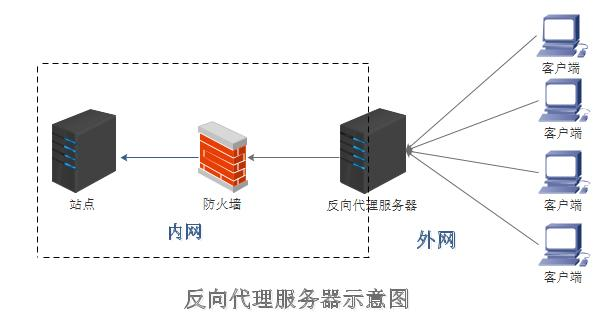

图2-1 展示了公网访问时的典型链路：用户浏览器不会直接接触后端内部地址，而是先访问公网入口，再由反向代理服务器把 `/api/*`、`/admin/*` 等请求转发到 FastAPI。这个模式可以避免在前端写死服务器 IP，也可以为后续绑定域名、开启 HTTPS、统一日志和限流预留空间。

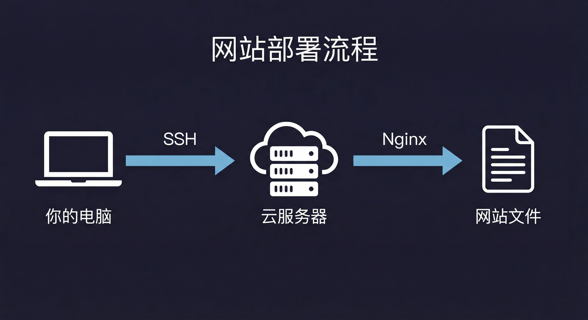

图2-2 可以理解为部署人员的工作视角：本地或远程终端通过远程桌面、PowerShell 或 SSH 类工具登录云服务器，在服务器上完成代码拉取、依赖安装、前端构建、后端启动和反向代理配置。当前项目部署在 Windows Server 上，实际远程连接方式通常是远程桌面或 PowerShell，而不是必须使用 Linux SSH。

### 2.5 典型业务流程

平台的典型使用流程如下：

```text
普通用户登录
  ↓
选择后端已启用的 Provider
  ↓
输入病害问题，或上传马铃薯叶片图片
  ↓
可选启用天气位置、网页搜索、深度思考
  ↓
前端把请求发送到 FastAPI
  ↓
后端读取用户、会话、Provider、天气和搜索上下文
  ↓
通过 chat/completions 调用外部模型
  ↓
流式返回 AI 回复、推理过程或识别结果
  ↓
保存会话历史和识别记录
```

这个流程说明了当前项目的职责边界：平台负责账号、文件、历史、上下文和 API 转发；外部大模型负责实际文本生成和图片理解；服务器不承担本地训练和重型推理任务。

### 2.6 当前主线与 legacy 边界

为了避免后续维护人员误接旧代码，必须明确以下边界：

| 内容 | 当前状态 | 是否进入主线 |
|------|----------|--------------|
| FastAPI 后端 | 当前主线 | 是 |
| Vue + Vite 前端 | 当前主线 | 是 |
| SQLite 演示库 | 当前默认 | 是 |
| 外部通用模型 Provider | 当前主线 | 是 |
| 本地 CNN 模型 | 历史资料 | 否 |
| `final_model.h5` | legacy 文件 | 否 |
| Notebook / Colab / Kaggle 训练脚本 | legacy 资料 | 否 |
| PPT、策划书、旧演示文件 | 项目资料 | 不参与运行 |

后续如果要重新引入训练、数据集或本地模型，应作为独立子项目评估，不应直接接回当前轻量演示部署主线。

---

## 3. 源码获取与本地准备

### 3.1 安装基础环境

在克隆源码前，请确保本地已安装以下基础软件：

| 软件 | 版本建议 | 验证命令 |
|------|---------|---------|
| Git | 最新版 | `git --version` |
| Python | 3.11 或 3.12 | `python --version`；`pip --version` |
| Node.js | LTS 版 | `node --version`；`npm --version` |

Windows Server 部署文档建议安装 Python 3.11 或 3.12，安装时勾选“Add python.exe to PATH”；Node.js 建议安装 LTS Windows 版。

### 3.2 克隆源码到本地仓库

打开终端（Windows 下推荐 PowerShell），执行以下命令：

```bash
git clone https://github.com/fuzong01-cloud/sazj.git
cd sazj
```

克隆完成后，当前工作目录即为项目根目录。

### 3.3 仓库目录结构说明

克隆后得到的仓库目录结构如下：

| 目录/文件 | 说明 |
|----------|------|
| `build.py` | 安装后端依赖并构建前端 |
| `start.py` | 启动 FastAPI 后端，默认使用 SQLite |
| `start_frontend.py` | 启动 Vite 前端开发服务 |
| `auto_update.py` | Windows Server 自动检查 GitHub 更新 |
| `final_model.h5` | legacy 本地 CNN 模型资料，不参与新系统运行 |
| `backend/` | FastAPI 后端代码，入口 `app/main.py` |
| `backend/app/api/` | FastAPI 路由（认证、识别、聊天、历史等） |
| `backend/app/core/` | 配置、安全、加密模块 |
| `backend/app/db/` | SQLAlchemy engine/session/init |
| `backend/app/models/` | 数据模型 |
| `backend/app/providers/` | 通用模型运行时、文本/视觉适配层 |
| `backend/app/repositories/` | 数据访问层 |
| `backend/app/schemas/` | Pydantic 数据模型 |
| `backend/app/services/` | 业务服务 |
| `backend/requirements.txt` | 后端 Python 依赖清单 |
| `frontend/` | Vue + Vite 前端源码 |
| `deploy/` | Windows Server 部署文档（含 NSSM、Caddy、防火墙说明） |
| `docs/` | legacy 快照与阶段说明 |
| `legacy/` | 历史资料归档，不参与新架构主线 |
| `main/` | legacy Colab/Kaggle 训练残留 |
| `uploads/` | 本地上传文件目录 |
| `logs/` | 本地日志目录 |
| `README.md` | 项目说明文档 |

当前后端依赖以 `backend/requirements.txt` 为准，旧 Flask/Streamlit 入口已清理，legacy 内容不属于当前代码主线。

---

## 4. 快速部署与开始使用

### 4.1 本地快速启动流程

**第一步：安装依赖并构建前端**

```bash
python build.py
```

该命令会安装 `backend/requirements.txt` 中的 Python 依赖，并执行前端 `npm install` 和 `npm run build`。

**第二步：启动后端**

```bash
python start.py
```

后端默认监听 `127.0.0.1:8000`，启动后自动创建 SQLite 数据库表和上传/日志目录。

**第三步：启动前端开发服务**（另开一个终端）

```bash
python start_frontend.py
```

前端 Vite 开发服务器默认监听 `127.0.0.1:5173`。

启动完成后，各服务访问地址如下：

| 服务 | 本地访问地址 |
|------|-------------|
| 前端页面 | `http://127.0.0.1:5173` |
| 后端 API | `http://127.0.0.1:8000` |
| 接口文档（Swagger） | `http://127.0.0.1:8000/docs` |
| Provider 管理页 | `http://127.0.0.1:8000/admin/providers` |

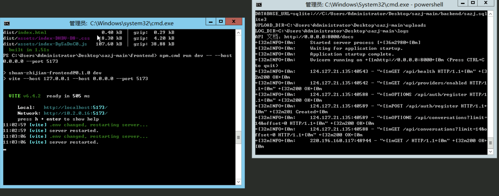

图4-1 展示了前端开发服务和 FastAPI 后端同时运行时的典型状态。左侧终端为前端服务，右侧终端为后端服务。服务器正式部署时不建议长期使用 `npm run dev` 对外提供前端，而应使用 `npm run build` 生成 `frontend/dist`，再由 Caddy 或其他静态服务托管。


### 4.2 后端健康检查

启动后端后，可通过以下地址确认服务是否正常运行：

```text
http://127.0.0.1:8000/api/health
```

预期返回健康状态 JSON。部署文档也把本机健康检查作为服务器验收的首要目标。

### 4.3 前端访问入口

普通用户通过浏览器访问前端页面：

- 本地开发：`http://127.0.0.1:5173`
- 服务器部署：`http://服务器公网IP` 或绑定的域名

### 4.4 接口文档入口

开发者可访问 FastAPI 自动生成的 Swagger 接口文档：

```text
http://127.0.0.1:8000/docs
```

在文档页面可直接测试各接口，无需额外安装工具。

---

## 5. 环境变量配置

### 5.1 `.env` 文件位置

环境变量可写在 `backend/.env` 或根目录 `.env` 中，**`backend/.env` 优先级更高**。服务器部署时，推荐在 `C:\sazj\.env` 中维护生产环境配置，并复制到 `C:\sazj\backend\.env`：

```powershell
Copy-Item C:\sazj\.env C:\sazj\backend\.env
```

### 5.2 本地 SQLite 默认配置

当前一个月轻量演示默认使用 SQLite，**不需要额外安装 PostgreSQL**。数据库文件默认位于 `backend/sazj.sqlite3`。开发阶段可使用 `AUTO_CREATE_TABLES=true` 自动建表，启动后端时会自动创建所需数据表。

### 5.3 关键环境变量说明

开发环境最小配置示例：

```env
DATABASE_URL=sqlite:///./sazj.sqlite3
AUTO_CREATE_TABLES=true
SQLITE_JOURNAL_MODE=OFF
UPLOAD_DIR=../uploads
LOG_DIR=../logs
FRONTEND_ORIGINS=http://127.0.0.1:5173,http://localhost:5173
PROVIDER_SECRET_KEY=development-provider-secret-key-change-me
ADMIN_WEBUI_TOKEN=development-admin-token-change-me
JWT_SECRET_KEY=development-jwt-secret-key-change-me
ACCESS_TOKEN_EXPIRE_MINUTES=1440
MAX_UPLOAD_BYTES=8388608
```

各变量含义说明：

| 变量名 | 用途 | 注意事项 |
|--------|------|---------|
| `DATABASE_URL` | 数据库连接地址 | 本地开发使用 SQLite 路径即可 |
| `AUTO_CREATE_TABLES` | 是否自动建表 | 开发阶段设为 `true`，后续正式迁移阶段再接 Alembic |
| `SQLITE_JOURNAL_MODE` | SQLite 日志模式 | 设为 `OFF` 可提升写入性能 |
| `UPLOAD_DIR` | 上传文件存储目录 | 后端启动时自动创建 |
| `LOG_DIR` | 日志文件目录 | 后端启动时自动创建 |
| `FRONTEND_ORIGINS` | 允许跨域访问的前端地址 | 本地开发填 Vite 地址，生产通常通过同源反代访问 |
| `PROVIDER_SECRET_KEY` | 加密模型 API Key | 部署后勿随意修改，否则旧配置无法解密 |
| `ADMIN_WEBUI_TOKEN` | 保护模型配置后台 | 只给项目维护者使用 |
| `JWT_SECRET_KEY` | 签发用户登录令牌 | 修改后旧 token 失效，用户需重新登录 |
| `ACCESS_TOKEN_EXPIRE_MINUTES` | 令牌过期时间（分钟） | 默认 1440（24 小时） |
| `MAX_UPLOAD_BYTES` | 单个上传文件大小上限 | 默认示例为 8MB，可根据服务器带宽和模型限制调整 |

> 生产或演示服务器必须替换 `PROVIDER_SECRET_KEY`、`ADMIN_WEBUI_TOKEN`、`JWT_SECRET_KEY` 三个密钥，并使用 32 字符以上的随机字符串。这些值不要提交到 GitHub。

### 5.4 生产环境配置建议

服务器部署时，建议使用绝对路径，避免 Windows 服务启动目录变化导致找不到数据库或上传目录：

```env
APP_ENV=production
API_PREFIX=/api
DATABASE_URL=sqlite:///C:/sazj/backend/sazj.sqlite3
AUTO_CREATE_TABLES=true
SQLITE_JOURNAL_MODE=OFF
FRONTEND_ORIGINS=http://服务器公网IP
UPLOAD_DIR=C:\sazj\uploads
LOG_DIR=C:\sazj\logs
PROVIDER_SECRET_KEY=请替换为32字符以上随机密钥
ADMIN_WEBUI_TOKEN=请替换为32字符以上随机管理员令牌
JWT_SECRET_KEY=请替换为32字符以上随机密钥
ACCESS_TOKEN_EXPIRE_MINUTES=1440
MAX_UPLOAD_BYTES=8388608
```

如果后续绑定域名，应把 `FRONTEND_ORIGINS` 改为实际域名，例如 `https://example.com`。如果通过 Caddy 做同源反向代理，浏览器访问前端和 API 都在同一域名下，跨域问题会明显减少。

---

## 6. Windows Server 服务器部署

### 6.1 推荐部署环境

当前默认部署目标为 Windows Server 轻量云服务器，推荐配置：

| 资源 | 规格 |
|------|------|
| CPU | 2 核 |
| 内存 | 2 GB |
| 存储 | 40 GB |
| 演示周期 | 一个月 |

服务器只运行 Vue 静态页面、FastAPI 后端、SQLite 数据库文件、上传文件存储和日志记录。**不要在服务器上训练 CNN、运行本地大模型或 TensorFlow 推理。**

### 6.2 推荐目录结构

推荐在服务器上建立以下目录结构：

```text
C:\sazj\
  backend\
  frontend\
  deploy\
  logs\
  uploads\
  .env
```

### 6.3 初始化后端环境

在服务器上打开 PowerShell，执行以下步骤：

```powershell
cd C:\sazj
python -m venv venv
.\venv\Scripts\activate
python -m pip install --upgrade pip
python build.py --skip-frontend
```

`--skip-frontend` 参数表示跳过前端构建（前端将在后续步骤中单独构建）。

首次启动前建议手动创建运行目录：

```powershell
New-Item -ItemType Directory -Force C:\sazj\logs
New-Item -ItemType Directory -Force C:\sazj\uploads
```

后端启动时也会自动创建 `UPLOAD_DIR` 和 `LOG_DIR`，但手动创建可避免潜在的权限问题。

### 6.4 启动 FastAPI 后端

```powershell
cd C:\sazj
.\venv\Scripts\activate
python start.py --host 0.0.0.0 --port 8000 --no-reload
```

参数说明：
- `--host 0.0.0.0`：允许外部访问。
- `--port 8000`：指定端口。
- `--no-reload`：关闭热重载，适用于生产环境。

启动后执行本机验证：

```powershell
Invoke-RestMethod http://127.0.0.1:8000/api/health
```

预期返回健康状态 JSON。

### 6.5 构建 Vue 前端

```powershell
cd C:\sazj\frontend
npm install
npm run build
```

构建产物位于 `C:\sazj\frontend\dist`，该目录将作为静态文件服务的根目录。

### 6.6 使用 Caddy 反向代理

短期演示优先推荐 **Caddy for Windows**，配置比 IIS 和 Nginx Windows 版更简单。示例 `Caddyfile`：

```caddyfile
:80 {
    root * C:\sazj\frontend\dist
    encode gzip
    try_files {path} /index.html
    file_server
    handle /api/* {
        reverse_proxy 127.0.0.1:8000
    }
    handle /admin/* {
        reverse_proxy 127.0.0.1:8000
    }
    handle /docs* {
        reverse_proxy 127.0.0.1:8000
    }
    handle /openapi.json {
        reverse_proxy 127.0.0.1:8000
    }
    handle /uploads/* {
        reverse_proxy 127.0.0.1:8000
    }
}
```

此配置将：
- 前端静态文件由 Caddy 直接响应（SPA 路由回退到 `index.html`）。
- `/api/*`、`/admin/*`、`/docs`、`/openapi.json` 和 `/uploads/*` 请求转发到 FastAPI 后端。

部署后，普通用户只需要访问 `http://服务器公网IP/`。前端页面中的 API 请求应通过相对路径访问，例如 `/api/health`、`/api/chat/stream`，不要在生产构建中写死 `127.0.0.1:8000` 或某个固定公网 IP。这样后续更换 IP、绑定域名或启用 HTTPS 时，不需要重新修改前端源码。


图6-1 再次强调了反向代理在部署中的作用：外网用户只访问 Caddy 暴露的 `80` 或 `443` 端口，FastAPI 后端可以只监听服务器本机 `127.0.0.1:8000` 或内网地址。若临时调试需要直接开放 `8000`，应在演示结束后关闭，避免后端接口绕过统一入口。

### 6.7 防火墙与公网访问

至少开放以下端口：

| 端口 | 用途 | 说明 |
|------|------|------|
| 80 | 前端页面和反向代理后的 API | 始终开放 |
| 8000 | 后端直接访问 | 仅在没有反向代理或临时调试时开放 |

不需要开放数据库端口，SQLite 是本地文件。

### 6.8 使用 NSSM 注册后端服务

为使服务器重启后后端自动恢复，建议使用 NSSM 将 FastAPI 注册为 Windows 服务。详细步骤见仓库文档 `deploy/windows_nssm_service.md`。

基本步骤概要：
1. 下载 NSSM 并解压。
2. 以管理员身份运行 `nssm install sazj-backend`。
3. 在 Application 标签页配置：
   - Path：`C:\sazj\venv\Scripts\python.exe`
   - Startup directory：`C:\sazj`
   - Arguments：`start.py --host 0.0.0.0 --port 8000 --no-reload`
4. 启动服务：`nssm start sazj-backend`。

### 6.9 自动更新

服务器部署完成后，可使用根目录 `auto_update.py` 定时检查 GitHub 更新。脚本从 `https://github.com/fuzong01-cloud/sazj` 的 `origin/main` 拉取新版本，只允许 fast-forward 更新，检测到本地未提交改动时自动停止。

**手动检查更新：**

```powershell
cd C:\sazj
.\venv\Scripts\python.exe auto_update.py --check-only
```

**执行更新并重启后端服务：**

```powershell
.\venv\Scripts\python.exe auto_update.py --restart-service --service-name sazj-backend
```

运行数据如 `.env`、SQLite 数据库、`uploads` 和 `logs` 不会被 Git 更新覆盖。

### 6.10 服务器数据备份与迁移

当前系统默认使用 SQLite，因此服务器上的关键运行数据主要集中在少数几个位置。部署人员在更新、迁移、重装系统或更换云服务器前，应至少备份以下内容：

| 路径 | 重要性 | 说明 |
|------|--------|------|
| `C:\sazj\.env` | 必须备份 | 保存生产密钥、管理员令牌、数据库路径等配置 |
| `C:\sazj\backend\.env` | 必须备份 | 后端实际读取的环境变量文件，若与根目录 `.env` 不同，以此为准 |
| `C:\sazj\backend\sazj.sqlite3` | 必须备份 | 用户、Provider、会话历史、识别记录等数据库内容 |
| `C:\sazj\uploads` | 建议备份 | 用户头像、上传文件等运行期文件 |
| `C:\sazj\logs` | 可选备份 | 排查问题所需日志，可按演示需要保留 |

其中最容易被忽略的是 `PROVIDER_SECRET_KEY`。Provider API Key 是加密保存到数据库中的，如果只复制 `sazj.sqlite3`，但服务器 `.env` 中的 `PROVIDER_SECRET_KEY` 发生变化，旧的 API Key 将无法解密。迁移时请保证数据库文件和 `PROVIDER_SECRET_KEY` 成对保留。

推荐备份命令：

```powershell
cd C:\sazj
New-Item -ItemType Directory -Force C:\sazj_backup
Copy-Item C:\sazj\.env C:\sazj_backup\.env -Force
Copy-Item C:\sazj\backend\.env C:\sazj_backup\backend.env -Force
Copy-Item C:\sazj\backend\sazj.sqlite3 C:\sazj_backup\sazj.sqlite3 -Force
Copy-Item C:\sazj\uploads C:\sazj_backup\uploads -Recurse -Force
```

恢复时，将 `.env`、`backend\.env`、`backend\sazj.sqlite3` 和 `uploads` 放回对应目录，然后重启后端服务即可。

### 6.11 部署验收清单

完成服务器部署后，建议按以下顺序验收：

| 序号 | 验收项 | 命令或入口 | 预期结果 |
|------|--------|------------|----------|
| 1 | 后端本机健康检查 | `Invoke-RestMethod http://127.0.0.1:8000/api/health` | 返回健康状态 JSON |
| 2 | 公网 API 健康检查 | `http://服务器公网IP/api/health` | 浏览器能看到健康状态 JSON |
| 3 | 前端页面 | `http://服务器公网IP/` | 能打开 WebUI |
| 4 | 后端在线状态 | 前端右上角 | 显示后端在线 |
| 5 | 管理端 | `http://服务器公网IP/admin/providers` | 能打开 Provider 管理页 |
| 6 | Provider 测试 | 管理端“测试连接” | 返回测试成功或明确上游错误 |
| 7 | 用户注册登录 | 前端登录弹窗 | 能创建用户并登录 |
| 8 | 文本问答 | 输入“你好” | 能收到模型回复并生成会话历史 |
| 9 | 图片识别 | 上传马铃薯叶片图片 | 能返回真实模型内容 |
| 10 | 重启恢复 | 重启服务器或服务 | 后端服务能自动恢复 |

如果第 1 项通过而第 2 项失败，优先检查 Caddy、Windows 防火墙和云服务器安全组。如果第 2 项通过但第 4 项失败，优先检查前端生产构建是否还在请求 `127.0.0.1:8000`。

---

## 7. 管理端使用说明

### 7.1 管理端入口

管理员通过以下地址访问 Provider 管理页面：

- 本地开发：`http://127.0.0.1:8000/admin/providers`
- 服务器部署：`http://服务器公网IP/admin/providers`

README 和部署文档均将 `/admin/providers` 作为 Provider 管理页。

### 7.2 管理员令牌登录

进入页面后，首先显示管理员登录界面，需要输入 `ADMIN_WEBUI_TOKEN`。该令牌来自环境变量配置，源码中 `admin_providers.py` 页面文案明确提示：“请输入后端管理员令牌。令牌来自环境变量 `ADMIN_WEBUI_TOKEN`。”

输入正确的令牌后，进入模型配置后台主界面。

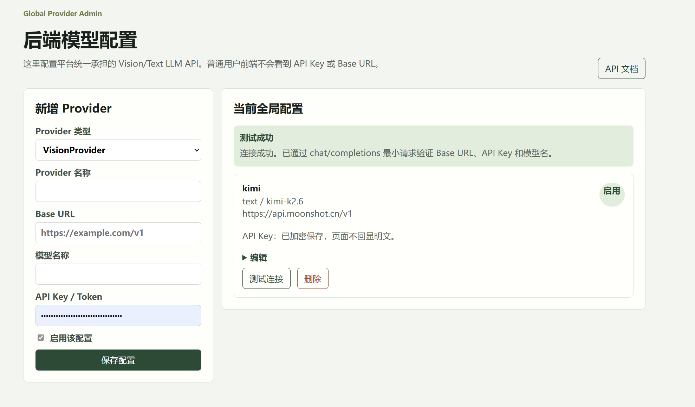

图7-1 是管理端 Provider 配置页面示例。左侧用于新增或编辑 Provider，右侧展示当前已保存配置。页面会提示测试连接结果，API Key 只显示“已加密保存”，不会回显明文。

### 7.3 新增通用模型 Provider

当前主线不再要求管理员分别理解“文字模型”和“视觉模型”两套入口。管理端表单中虽然底层仍保留兼容字段，但页面认知应统一为 **通用模型 Provider**：同一个 Provider 可以被前端选择，并用于普通文本问答、图片识别、防治建议生成、网页搜索结果总结等场景。是否真正支持图片输入，取决于所配置的上游模型本身是否支持多模态 `chat/completions`。

在“新增 Provider”表单中填写以下信息：

| 字段 | 说明 |
|------|------|
| Provider 名称 | 用于前端展示的提供商标识 |
| Base URL | 模型 API 的基础地址 |
| API Key | 模型 API 密钥（加密保存，不回显明文） |
| 模型名 | 实际调用的模型 ID |
| 是否启用 | 勾选后该 Provider 才可被调用 |
| 支持深度思考/推理 | 可选，标记是否支持推理过程展示 |
| 上下文长度 | 可选，模型最大上下文 token 数 |
| 最大输出长度 | 可选，模型单次最大输出 token 数 |

示例配置：

| 供应商 | Base URL 示例 | 模型名示例 | 说明 |
|--------|---------------|-----------|------|
| Moonshot / Kimi | `https://api.moonshot.cn/v1` | `kimi-k2.6` | 走 `chat/completions`，适合文本和多模态能力验证 |
| 其他 OpenAI-compatible 服务 | `https://example.com/v1` | 以供应商文档为准 | 需要确认是否兼容 `messages` 和 `image_url` |

> 管理端“Provider 名称”是给前端用户看的，例如 `Kimi`、`Meituan`、`演示模型`。真实调用上游时使用的是“模型名”字段，例如 `kimi-k2.6`。前端不会把 `Kimi / kimi-k2.6` 这类展示字符串提交给上游。

### 7.4 快速模型与深度思考模型

为了兼顾响应速度和推理深度，管理端允许通过“支持深度思考/推理”区分模型：

- **未勾选**：作为非推理/快速模型，适合作为前端默认模型，回复更快，较少占用 `reasoning_content`。
- **已勾选**：作为深度思考模型，适合用户在前端打开“深度思考”按钮时使用。

当前前端会尽量优先选择快速模型作为默认模型。用户打开“深度思考”后，后端会优先寻找支持推理的已启用 Provider；如果没有可用推理模型，则会回退到普通模型，并在实际回答中只展示可获得的内容。

建议至少配置两个 Provider：

| 用途 | 建议配置 |
|------|----------|
| 默认快速回答 | 一个稳定、低延迟、非推理模型 |
| 深度思考 | 一个支持推理过程或长上下文的模型 |

如果只有一个模型，也可以只配置一个 Provider。图片识别、文本问答和防治建议都会使用前端当前选中的 Provider。

### 7.5 测试 Provider 连接

管理页提供"测试连接"功能，用于验证 Base URL、API Key 和模型名是否能完成基础 `chat/completions` 调用。部署文档中将测试连接列为验收目标之一。

> 注意：测试连接只验证基础 `chat/completions` 连通性，不保证视觉图片识别一定可用。调用 `/api/predict` 或 `/api/chat` 时如果返回 502，应优先检查 `base_url`、`api_key`、`model_name` 配置，并确认上游模型是否支持图片输入。

### 7.6 编辑、停用、删除 Provider

管理员可以对已有 Provider 配置执行以下操作：

- **编辑**：修改 Provider 名称、Base URL、模型名、API Key（如不填写则保留原 Key）、启用状态、推理支持等。
- **停用**：取消"是否启用"勾选并保存，该 Provider 将不再被调用。
- **删除**：移除 Provider 配置。

源码中管理页包含保存、测试连接和删除操作，API Key 加密保存、不回显明文。

### 7.7 管理端安全注意事项

1. `ADMIN_WEBUI_TOKEN` 只发给项目维护者，不应发给普通用户。
2. Provider API Key 使用 `PROVIDER_SECRET_KEY` 加密存储，普通用户前端看不到 API Key 或 Base URL。
3. 生产环境必须将开发默认令牌替换为 32 字符以上的随机字符串。
4. 部署后不要随意修改 `PROVIDER_SECRET_KEY`，否则数据库中已经保存的加密 API Key 将无法解密，需要重新配置 Provider。
5. 不要把 `/admin/providers` 的令牌写入前端代码，也不要截图公开管理页中的配置细节。

---

## 8. 用户端使用说明

### 8.1 用户端入口

普通用户通过浏览器访问前端页面：

- 本地开发：`http://127.0.0.1:5173`
- 服务器部署：`http://服务器公网IP` 或域名

前端提供 ChatGPT 风格对话页面，包含左侧可收起的侧边栏、品牌标识、创建新聊天、搜索聊天、历史对话列表和用户信息展示。

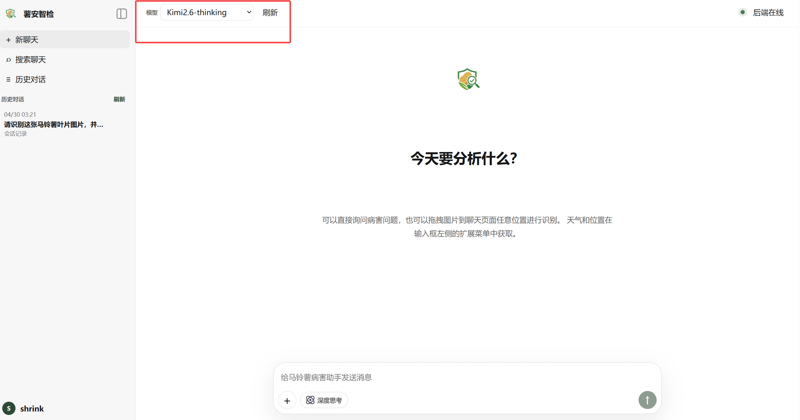

页面主要区域说明：

| 区域 | 功能 |
|------|------|
| 左侧侧边栏 | 新建聊天、搜索聊天、查看历史、登录或打开个人资料 |
| 顶部栏 | 选择当前 Provider、刷新模型列表、查看后端在线状态 |
| 中央消息区 | 展示用户消息、AI 回复、图片预览、推理过程和 Markdown 内容 |
| 底部输入框 | 输入问题、上传图片、启用深度思考、启用天气位置和网页搜索 |

侧边栏可收起。收起后页面只保留展开按钮，主聊天区不会向左坍缩，适合在小屏幕或投影演示时使用。

图8-1 展示了普通用户进入系统后的主界面。顶部可以选择后端已经启用的 Provider，并查看后端在线状态；左侧是历史对话；底部是输入框和扩展功能入口。

### 8.2 注册账号

用户通过前端注册面板创建账号。后端提供 `POST /api/auth/register` 接口，注册成功即返回访问令牌（Bearer Token）。前端调用 `registerUser` 完成注册并保存令牌。

### 8.3 登录账号

用户通过用户名和密码登录。后端提供 `POST /api/auth/login`，验证凭据后返回 Bearer Token；前端将 token 保存在本地（localStorage），用于后续请求的 `Authorization` 头部。

登录成功后，用户密码使用 PBKDF2 哈希保存，登录使用 Bearer Token 进行身份验证。

### 8.4 查看和修改个人资料

已登录用户可通过以下接口管理个人资料：

| 操作 | 接口 |
|------|------|
| 获取用户信息 | `GET /api/auth/me` |
| 更新个人资料 | `PATCH /api/auth/me` |
| 修改密码 | `PUT /api/auth/me/password` |
| 上传头像 | `POST /api/auth/me/avatar` |

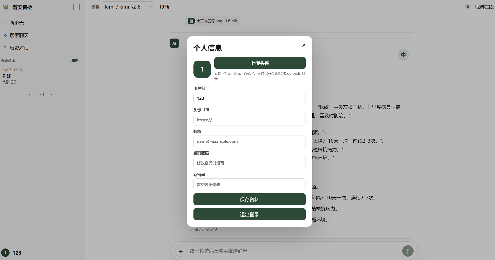

图8-2 展示了个人信息弹窗。用户可以上传头像、修改用户名、填写邮箱或修改密码。头像文件会保存到服务器上传目录，资料保存后会同步更新侧边栏底部的用户信息。

### 8.5 上传马铃薯病害图片进行识别

用户登录后，可通过以下方式上传图片：

- 输入框点击上传按钮
- 页面拖拽上传
- 剪贴板粘贴图片

前端将图片发送至 `/api/predict`（普通）或 `/api/predict/stream`（流式），后端读取图片并调用当前选中的通用 Provider。后端不会把本地文件路径直接发给上游模型，而是把图片内容转换为多模态 `messages` 所需的 `image_url` data URL，再通过 `chat/completions` 发送给外部模型。源码中 `predict.py` 将上传文件传给 prediction service，并在登录状态下绑定当前用户 ID。

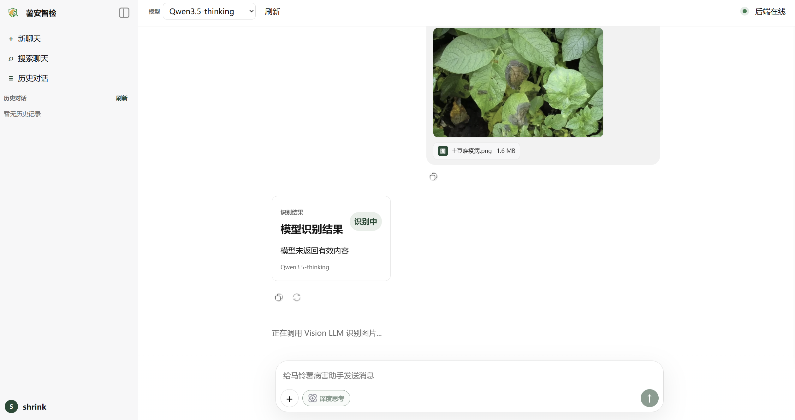

图8-3 展示了图片上传后等待模型识别的过程。如果页面长时间停留在“识别中”，应检查上游模型是否支持图片输入、网络是否稳定、图片是否过大，以及后端日志中是否有上游超时或 400/429 错误。

### 8.6 查看识别结果

识别结果包含以下字段：

| 字段 | 说明 |
|------|------|
| 疾病名称 | 模型判定的病害类别 |
| 风险等级 | 病害严重程度评估 |
| 置信度 | 模型给出的置信度分数 |
| 摘要 | 识别结果简述 |
| 防治建议 | AI 生成的针对性防治措施 |
| 原始模型输出 | 模型返回的完整文本 |

`POST /api/predict` 成功后，结果写入 `prediction_records` 表，同时保存 provider 名称、模型名等元数据。

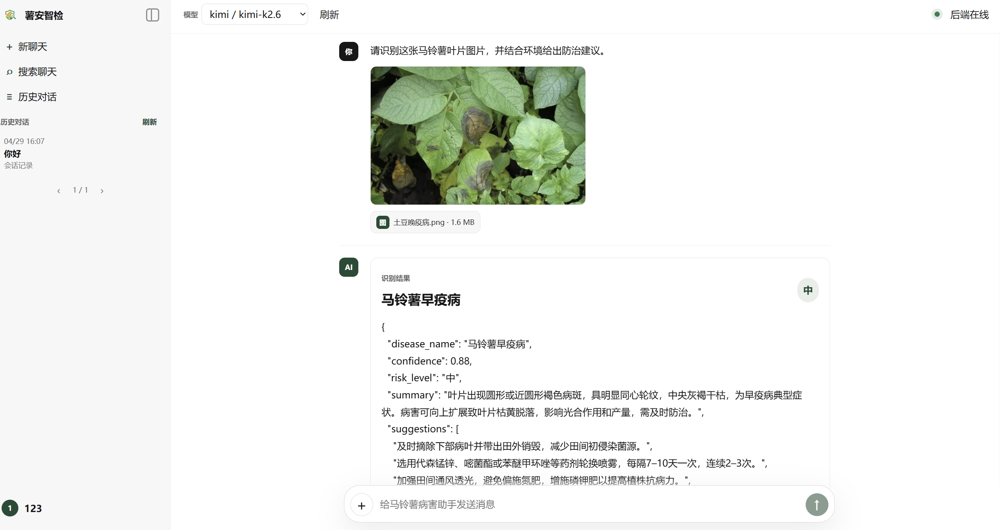

图8-4 展示了模型返回结构化内容时的识别结果。页面会尽量展示病害名称、置信度、风险等级、摘要和建议。如果模型只返回普通自然语言文本，前端也会展示原始文本，不应直接丢弃。

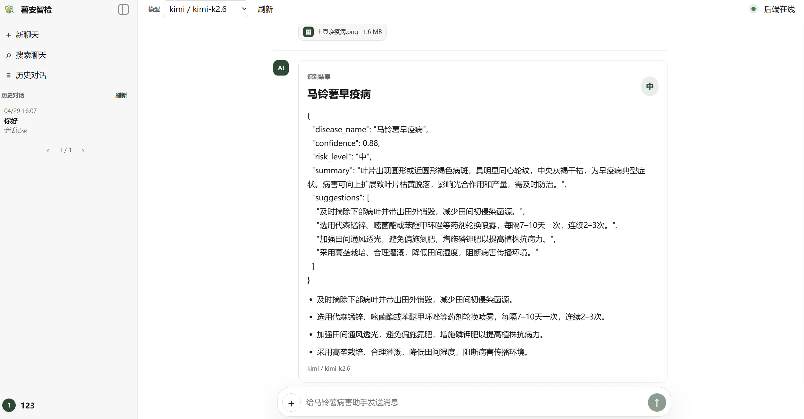

图8-5 展示了 Markdown 渲染后的建议列表。对于用户来说，重点关注病害判断、风险等级和防治建议；对于维护人员来说，还应关注模型名称和 Provider 是否符合预期。

### 8.7 使用 AI 助手

用户可在对话界面直接向马铃薯病害助手提问。前端调用 `/api/chat`（普通）或 `/api/chat/stream`（流式），后端通过当前选中的通用 Provider 生成回答。AI 回复支持以下特性：

- Markdown 渲染
- 推理过程展示（如模型支持深度思考）
- 复制和重新生成按钮
- 流式输出（SSE 反缓冲响应头，便于前端实时显示）

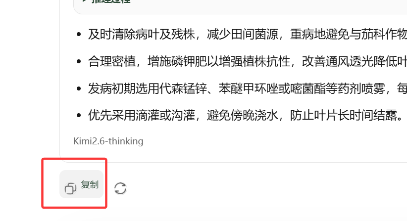

图8-6 中的复制按钮用于复制某条 AI 回复内容。复制后用户可以把诊断结果粘贴到报告、微信群、课堂展示材料或项目验收文档中。

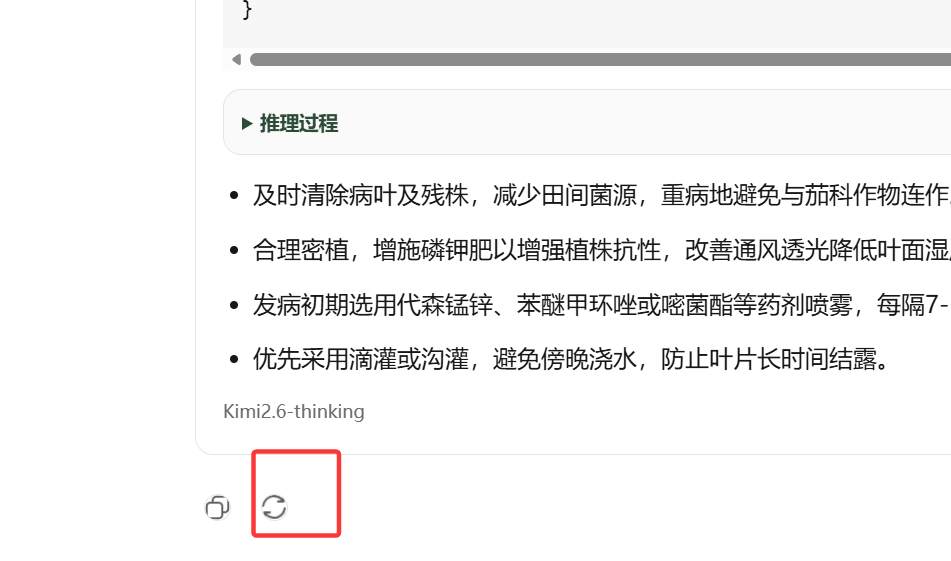

图8-7 中的重新生成按钮用于让当前模型基于同一条用户输入再次回答。适合在回答不完整、格式不理想、上游模型短暂异常或需要更换表达方式时使用。

### 8.8 查看历史记录

登录用户可查看两类历史记录：

- **聊天历史（conversations）**：当前前端主要使用的对话记录，支持查询、重命名和删除。接口包括 `GET /api/conversations`、`GET /api/conversations/{id}`、`PATCH /api/conversations/{id}`、`DELETE /api/conversations/{id}`。
- **识别记录（history）**：保留给旧识别记录和兼容场景。接口包括 `GET /api/history`。

左侧历史列表中的每一条记录会显示会话标题和时间。鼠标悬停到某条历史记录右侧时，会出现“···”菜单，可执行重命名或删除。重命名使用弹窗输入框，保存后会立即刷新侧边栏；删除后该会话及关联消息会从当前用户历史中移除。

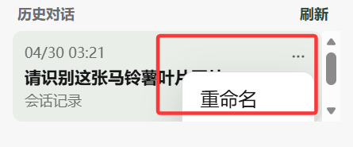

### 8.9 删除历史记录

历史记录支持查询和逐条删除，接口包括 `GET /api/history`、`GET /api/history/{id}`、`DELETE /api/history/{id}`。

对于当前前端主路径，用户更常使用的是会话删除，即左侧历史对话菜单中的“删除”。如果只是删除旧识别记录，可以通过 `/api/history/{id}` 接口完成；如果删除整个聊天会话，则使用 `/api/conversations/{id}`。

### 8.10 天气、定位与辅助建议

前端可获取用户定位和天气信息，后端在生成识别结果和防治建议时能结合天气、湿度、降水和气候带数据进行辅助判断。该功能已列入部署验收目标。

### 8.11 深度思考、网页搜索与附件使用建议

输入框左下角提供“深度思考”按钮。开启后，前端会把 `deep_thinking=true` 发送给后端，后端优先选择支持推理的 Provider，并在流式回复中展示推理过程。如果上游模型不返回推理字段，页面仍会展示正常回答内容，不应把“没有推理过程”视为接口故障。

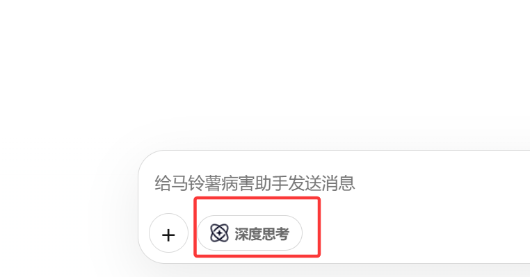

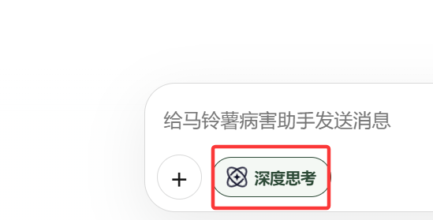

深度思考按钮关闭时使用普通灰色样式，开启时使用绿色重点色。开启深度思考通常会增加响应时间和 Token 消耗，因此普通问候、简单说明、短文本整理不建议打开；复杂病害分析、方案比较、综合天气和网页资料判断时再打开更合适。

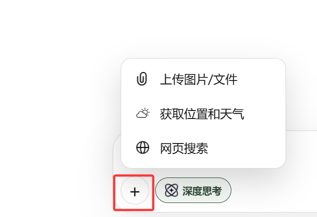

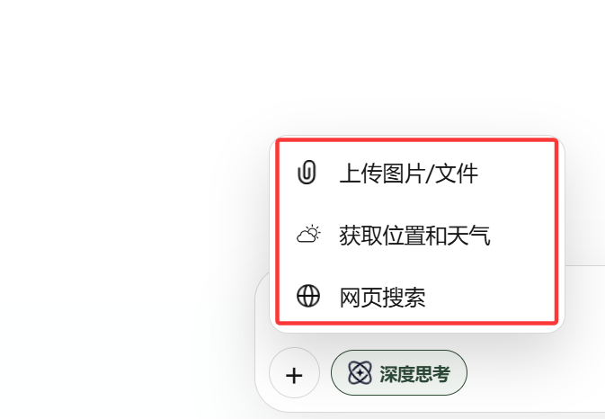

加号菜单中的“网页搜索”适合以下场景：

- 查询近期病害防治资讯。
- 询问药剂使用、气候影响、病害流行趋势等需要外部资料的问题。
- 对识别结果进行二次解释，希望模型参考网页资料。

加号菜单中的“获取位置和天气”适合图片识别和防治建议场景。启用后，模型回答会结合当前经纬度、温度、湿度、降水、风速和气候带等信息，但该判断仍属于辅助建议，实际防治应以当地农技人员意见和农药标签规范为准。

附件上传支持点击、拖拽和剪贴板粘贴。推荐上传清晰、无遮挡、光照稳定的马铃薯叶片或植株局部照片；如果图片中包含多片叶片，应在文字中说明希望重点分析哪一处病斑。

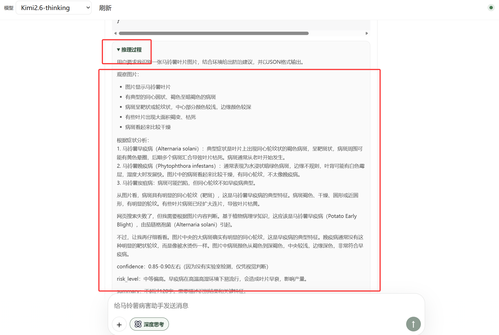

图8-13 展示了深度思考模型返回推理过程时的页面效果。推理过程主要用于提升可解释性和演示效果，不应被直接当作最终农技结论。最终建议仍应结合模型最终回答、图片质量、当地气象条件和人工判断。

---

## 9. 主要接口说明

> 以下接口来自 README 的主要接口清单。

### 9.1 健康检查接口

| 方法 | 路径 | 说明 |
|------|------|------|
| GET | `/api/health` | 返回后端健康状态 |

### 9.2 用户认证接口

| 方法 | 路径 | 说明 |
|------|------|------|
| POST | `/api/auth/register` | 用户注册，返回访问令牌 |
| POST | `/api/auth/login` | 用户登录，返回访问令牌 |
| GET | `/api/auth/me` | 获取当前用户信息 |
| PATCH | `/api/auth/me` | 更新个人资料 |
| PUT | `/api/auth/me/password` | 修改密码 |
| POST | `/api/auth/me/avatar` | 上传头像 |

### 9.3 图片识别接口

| 方法 | 路径 | 说明 |
|------|------|------|
| POST | `/api/predict` | 上传图片进行病害识别（非流式） |
| POST | `/api/predict/stream` | 上传图片进行病害识别（SSE 流式） |

### 9.4 AI 助手接口

| 方法 | 路径 | 说明 |
|------|------|------|
| POST | `/api/chat` | 发送消息获取 AI 回复（非流式） |
| POST | `/api/chat/stream` | 发送消息获取 AI 回复（SSE 流式） |

### 9.5 防治建议接口

| 方法 | 路径 | 说明 |
|------|------|------|
| POST | `/api/advice/generate` | 生成防治建议 |

### 9.6 天气与网页搜索接口

| 方法 | 路径 | 说明 |
|------|------|------|
| GET | `/api/weather` | 获取天气信息 |
| GET | `/api/search/web` | 网页搜索，用于给模型回答补充搜索上下文 |

### 9.7 会话与历史接口

| 方法 | 路径 | 说明 |
|------|------|------|
| GET | `/api/conversations` | 获取对话列表 |
| GET | `/api/conversations/{id}` | 获取指定对话详情 |
| PATCH | `/api/conversations/{id}` | 重命名对话 |
| DELETE | `/api/conversations/{id}` | 删除对话 |
| GET | `/api/history` | 获取历史识别记录列表 |
| GET | `/api/history/{id}` | 获取指定识别记录详情 |
| DELETE | `/api/history/{id}` | 删除指定识别记录 |

当前前端主要使用 `conversations` 作为聊天历史；`history` 仍保留给旧识别记录和兼容场景。

---

## 10. 常见问题与排查

### 10.1 前端打不开

| 排查项 | 操作 |
|--------|------|
| 前端服务是否启动 | 检查 `python start_frontend.py` 是否运行，Vite 端口是否为 5173 |
| 服务器防火墙和安全组 | 检查云服务器安全组是否已开放 80 端口，Windows 防火墙入站规则是否允许 |
| 反向代理是否正常 | 检查 Caddy 是否已启动并正确配置 |

### 10.2 后端无法访问

| 排查项 | 操作 |
|--------|------|
| 后端进程是否运行 | 检查 `python start.py` 是否正在运行，端口是否为 8000 |
| 监听地址 | 服务器部署时必须使用 `--host 0.0.0.0`，否则外部无法访问 |
| 安全组和防火墙 | 检查是否开放 80（反向代理）或 8000（直接访问）端口 |
| 服务是否注册 | 如果使用 NSSM，检查服务是否处于"正在运行"状态 |

### 10.3 前端显示后端离线

| 排查项 | 操作 |
|--------|------|
| 反向代理配置 | 检查 Caddy 配置，确认 `/api/*` 正确转发到 `127.0.0.1:8000` |
| 健康检查 | 在浏览器直接访问 `http://服务器公网IP/api/health`，确认能返回 JSON 健康状态 |

如果服务器本机访问前端显示“后端在线”，但你自己的电脑通过公网 IP 访问显示“后端离线”，最常见原因是生产前端仍在请求 `http://127.0.0.1:8000`。浏览器中的 `127.0.0.1` 永远指向用户自己的电脑，而不是服务器。生产部署推荐让前端请求相对路径 `/api/...`，再由 Caddy 把 `/api/*` 转发到服务器本机的 `127.0.0.1:8000`。

### 10.4 Provider 测试失败

| 排查项 | 操作 |
|--------|------|
| Base URL | 检查是否填写正确，注意路径末尾不要有多余的 `/v1/v1` 或 `/responses` |
| API Key | 检查是否有效，是否已过期 |
| 模型名 | 检查模型名是否与 API 提供商的要求一致 |
| Provider 状态 | 确认至少有一个通用 Provider 已启用 |
| 连通性 vs 视觉能力 | 测试连接只验证基础 `chat/completions` 连通性，不保证视觉图片识别一定可用 |

### 10.5 图片识别失败

| 排查项 | 操作 |
|--------|------|
| Provider 配置 | 检查是否已配置并启用通用 Provider |
| 图片格式 | 确认上传的图片格式有效（支持常见格式如 JPG、PNG） |
| 文件大小 | 检查是否超过 `MAX_UPLOAD_BYTES` 限制（默认 8MB） |
| 外部 API 可用性 | 检查所使用的模型 API 服务是否正常运行 |
| 图片能力 | 确认当前模型支持多模态图片输入，纯文本模型即使测试连接成功，也无法识图 |

### 10.6 AI 助手无响应

| 排查项 | 操作 |
|--------|------|
| Provider 配置 | 检查是否已配置并启用通用 Provider |
| API Key 有效性 | 检查 API Key 是否有效 |
| 网络连通性 | 检查服务器是否能访问模型 API 的 Base URL |
| 流式输出支持 | 如果使用流式接口，检查反向代理是否支持 SSE（Caddy 默认支持） |

### 10.7 上传目录或日志目录报错

| 排查项 | 操作 |
|--------|------|
| 目录是否存在 | 检查 `UPLOAD_DIR` 和 `LOG_DIR` 对应的路径是否存在 |
| 目录权限 | 确认运行后端服务的 Windows 用户对这两个目录有写权限 |
| 日志文件未生成 | 检查 NSSM 服务使用的 Windows 用户是否有写权限；应用会优先保证服务启动，如文件日志无法打开，会在控制台或 NSSM stderr 日志中输出提示 |

### 10.8 服务器内存不足

2 核 2GB 服务器只适合运行 Web 服务、SQLite、上传文件和外部 API 转发。**不要在服务器上执行以下操作：**

- 训练 CNN 模型
- 运行 Jupyter Notebook 或 Colab 脚本
- 运行本地大模型或 TensorFlow 推理
- 运行 `final_model.h5` 相关代码


---

## 11. 当前限制与后续规划

### 11.1 当前限制

以下为当前版本（v0.6.0）的已知限制：

| 限制项 | 说明 |
|--------|------|
| 数据库 | SQLite 适合本地开发和短期演示，不适合长期高并发生产环境 |
| 数据库迁移 | 尚未接入 Alembic，目前以开发期自动建表为主 |
| 网页搜索 | 使用轻量 HTML 搜索方式，稳定性取决于外部搜索页面可访问性 |
| 流式输出 | 效果取决于上游模型、网络、浏览器和反向代理是否真正逐块返回数据 |
| 天气和气候带 | 轻量实现，尚未结合长期气候统计、海拔、土壤和区域病害流行数据 |
| 管理后台 | 区域统计、风险预警、知识库增强、防治建议管理后台仍待继续建设 |

### 11.2 后续建设方向

下一阶段计划按以下优先级推进：

1. 稳定 WebUI 流式输出和深度思考体验。
2. 完善会话重试、复制、错误回显和模型过载提示。
3. 增加区域统计和风险预警数据表。
4. 建立防治建议管理和知识库增强接口。
5. 补充系统日志入库和管理端查看页面。
6. 为 Windows Server 演示部署补充一键检查脚本。
7. 在需要更高并发或长期运行时，设计 SQLite 到 PostgreSQL 的迁移方案。

---

## 12. 附录

### 12.1 常用命令汇总

| 场景 | 命令 |
|------|------|
| 克隆仓库 | `git clone https://github.com/fuzong01-cloud/sazj.git` |
| 安装依赖并构建前端 | `python build.py` |
| 仅安装依赖（跳过前端） | `python build.py --skip-frontend` |
| 启动后端（本地开发） | `python start.py` |
| 启动后端（服务器部署） | `python start.py --host 0.0.0.0 --port 8000 --no-reload` |
| 启动前端开发服务 | `python start_frontend.py` |
| 构建前端生产包 | `cd frontend && npm install && npm run build` |
| 后端健康检查 | `curl http://127.0.0.1:8000/api/health` |
| 服务器本机验证（PowerShell） | `Invoke-RestMethod http://127.0.0.1:8000/api/health` |
| 自动更新检查 | `python auto_update.py --check-only` |
| 自动更新并重启服务 | `python auto_update.py --restart-service --service-name sazj-backend` |

### 12.2 默认访问地址汇总

| 服务 | 本地开发 | 服务器部署 |
|------|---------|-----------|
| 前端页面 | `http://127.0.0.1:5173` | `http://服务器公网IP` |
| 后端 API | `http://127.0.0.1:8000` | `http://服务器公网IP/api/*` |
| 接口文档（Swagger） | `http://127.0.0.1:8000/docs` | `http://服务器公网IP/docs` |
| Provider 管理页 | `http://127.0.0.1:8000/admin/providers` | `http://服务器公网IP/admin/providers` |
| 健康检查 | `http://127.0.0.1:8000/api/health` | `http://服务器公网IP/api/health` |

### 12.3 环境变量模板

**开发环境 `.env`：**

```env
DATABASE_URL=sqlite:///./sazj.sqlite3
AUTO_CREATE_TABLES=true
SQLITE_JOURNAL_MODE=OFF
UPLOAD_DIR=../uploads
LOG_DIR=../logs
PROVIDER_SECRET_KEY=development-provider-secret-key-change-me
ADMIN_WEBUI_TOKEN=development-admin-token-change-me
JWT_SECRET_KEY=development-jwt-secret-key-change-me
ACCESS_TOKEN_EXPIRE_MINUTES=1440
```

**Windows Server 演示环境 `.env`：**

```env
APP_ENV=production
API_PREFIX=/api
DATABASE_URL=sqlite:///C:/sazj/backend/sazj.sqlite3
AUTO_CREATE_TABLES=true
SQLITE_JOURNAL_MODE=OFF
FRONTEND_ORIGINS=http://服务器公网IP
UPLOAD_DIR=C:\sazj\uploads
LOG_DIR=C:\sazj\logs
PROVIDER_SECRET_KEY=请替换为32字符以上随机密钥
ADMIN_WEBUI_TOKEN=请替换为32字符以上随机管理员令牌
JWT_SECRET_KEY=请替换为32字符以上随机密钥
ACCESS_TOKEN_EXPIRE_MINUTES=1440
MAX_UPLOAD_BYTES=8388608
```

### 12.4 术语解释

| 术语 | 解释 |
|------|------|
| **通用 Provider** | 后端配置的大模型供应商，当前同时服务文本问答、图片识别和防治建议 |
| **多模态模型** | 能在 `chat/completions` 中接收图片和文本的模型 |
| **深度思考模型** | 能返回推理过程或适合长推理任务的模型，前端通过“深度思考”按钮启用 |
| **OpenAI-compatible API** | 兼容 OpenAI `chat/completions` 格式的 API 接口规范 |
| **SQLite** | 轻量级文件数据库，无需额外安装数据库服务 |
| **FastAPI** | Python 异步 Web 框架，用于构建后端 API |
| **Uvicorn** | ASGI 服务器，用于运行 FastAPI 应用 |
| **Vite** | 前端构建工具，提供开发服务器和热更新 |
| **Caddy** | 轻量 Web 服务器和反向代理，支持自动 HTTPS |
| **NSSM** | Non-Sucking Service Manager，可将任何程序注册为 Windows 服务 |
| **Bearer Token** | HTTP 认证方式，在请求头中携带访问令牌 |
| **SSE** | Server-Sent Events，服务端向客户端推送实时数据的技术 |
| **SPA** | Single Page Application，单页面应用 |

### 12.5 Legacy 文件说明

以下内容只作为历史资料，不参与新架构主线：

| 文件/目录 | 说明 |
|----------|------|
| `final_model.h5` | 旧版本地 CNN 模型权重文件 |
| `main/` | 旧 Notebook、Colab、Kaggle/PlantVillage 训练残留 |
| 旧 PPT、策划书、演示资料 | 项目历史文档 |
| 旧 Flask/Streamlit 入口 | 已清理的旧框架入口代码 |
| `legacy/` | 其他历史资料归档目录 |

更换数据集、寻找训练脚本、彻底割裂 Kaggle 数据集粘连不属于当前代码主线。系统当前核心价值在于将外部大模型能力、安全的后台模型配置、用户会话历史和可部署的 WebUI 组合成一个轻量演示平台。

---

## 13. 场景化操作手册

本章按实际使用场景组织，不再从技术模块出发，而是从“我要完成一件事”的角度给出操作步骤。项目演示、服务器部署、普通用户上手和故障排查时，可优先查阅本章。

### 13.1 场景一：第一次在服务器上完成演示部署

适用对象：部署人员、项目演示人员。

目标：在 Windows Server 上完成一次可公网访问的演示部署，让普通用户可以通过浏览器访问平台，完成注册、登录、文本问答和图片识别。

建议流程如下：

1. 准备服务器。
   - 确认服务器系统是 Windows Server。
   - 确认云服务器安全组至少开放 `80` 端口。
   - 如果临时不配置反向代理，可开放 `8000`，但正式演示建议关闭。
   - 确认服务器剩余磁盘空间至少 10GB。

2. 安装基础软件。
   - 安装 Git for Windows。
   - 安装 Python 3.11 或 3.12。
   - 安装 Node.js LTS。
   - 安装 Caddy for Windows。
   - 可选安装 NSSM，用于后端服务守护。

3. 拉取项目代码。

```powershell
cd C:\
git clone https://github.com/fuzong01-cloud/sazj.git
cd C:\sazj
```

4. 准备环境变量。
   - 在 `C:\sazj\.env` 中写入生产配置。
   - 复制一份到 `C:\sazj\backend\.env`。
   - 确认 `PROVIDER_SECRET_KEY`、`ADMIN_WEBUI_TOKEN`、`JWT_SECRET_KEY` 已替换为随机长字符串。

5. 初始化后端。

```powershell
cd C:\sazj
python -m venv venv
.\venv\Scripts\activate
python -m pip install --upgrade pip
python build.py --skip-frontend
```

6. 构建前端。

```powershell
cd C:\sazj\frontend
npm install
npm run build
```

7. 启动后端验证。

```powershell
cd C:\sazj
.\venv\Scripts\activate
python start.py --host 0.0.0.0 --port 8000 --no-reload
```

打开另一个 PowerShell 窗口验证：

```powershell
Invoke-RestMethod http://127.0.0.1:8000/api/health
```

8. 配置 Caddy。
   - 将 `Caddyfile` 指向 `C:\sazj\frontend\dist`。
   - 将 `/api/*`、`/admin/*`、`/docs*`、`/openapi.json`、`/uploads/*` 反向代理到 `127.0.0.1:8000`。
   - 启动 Caddy 后访问 `http://服务器公网IP/`。

9. 配置 Provider。
   - 访问 `http://服务器公网IP/admin/providers`。
   - 输入 `ADMIN_WEBUI_TOKEN`。
   - 新增 Provider，填写 Base URL、API Key、模型名。
   - 点击“测试连接”。

10. 完成演示验收。
    - 注册普通用户。
    - 发送“你好”，确认模型能回复。
    - 上传马铃薯叶片图片，确认能返回识别结果。
    - 启用深度思考，确认页面能显示推理过程或正常回答。
    - 启用天气位置和网页搜索，确认不会影响基本问答。

验收通过后，再把后端注册为 NSSM 服务。这样服务器重启后，后端可以自动恢复。

### 13.2 场景二：管理员首次配置 Kimi / Moonshot Provider

适用对象：平台维护者。

目标：让后台 Provider 连接 Moonshot/Kimi，并让普通前端可以选择该 Provider。

配置步骤：

1. 打开管理页。

```text
http://服务器公网IP/admin/providers
```

2. 输入管理员令牌。

管理员令牌来自 `.env` 中的：

```env
ADMIN_WEBUI_TOKEN=你的管理员令牌
```

3. 填写 Provider 表单。

| 字段 | 示例 |
|------|------|
| Provider 名称 | `Kimi` |
| Base URL | `https://api.moonshot.cn/v1` |
| 模型名称 | `kimi-k2.6` |
| API Key / Token | 你的 Moonshot API Key |
| 启用该配置 | 勾选 |
| 支持深度思考/推理 | 根据模型能力决定 |
| 上下文长度 | 可留空或填供应商推荐值 |
| 输出长度上限 | 可留空或填 `1024`、`2048` |

4. 保存配置。

保存后，API Key 会加密写入 SQLite 数据库中的 `model_configs` 表。页面不会再回显 API Key 明文。

5. 测试连接。

点击“测试连接”后，后端会按以下逻辑发起请求：

```text
POST https://api.moonshot.cn/v1/chat/completions
```

请求体采用最小兼容格式：

```json
{
  "model": "kimi-k2.6",
  "messages": [
    {
      "role": "user",
      "content": "你好，请只回复 OK"
    }
  ],
  "max_tokens": 128
}
```

测试成功说明 Base URL、API Key、模型名和基础文本调用链路可用。若测试失败，应优先查看页面显示的上游错误信息，而不是只判断“配置错误”。

6. 回到前端刷新模型列表。

普通用户页面顶部点击“刷新”，模型下拉框应出现 Provider 名称。当前前端只展示 Provider 名称，不展示真实模型 ID，避免用户混淆。

### 13.3 场景三：普通用户完成一次病害识别

适用对象：普通用户、演示人员。

目标：用户上传马铃薯叶片图片，让 AI 返回诊断和防治建议。

推荐操作流程：

1. 登录系统。
   - 如果没有账号，先注册。
   - 登录后左下角显示用户头像或用户名。

2. 选择模型。
   - 顶部模型下拉框选择管理员配置好的 Provider。
   - 如果只是普通识别，建议先使用快速模型。
   - 如果需要详细分析，再打开“深度思考”。

3. 可选启用天气位置。
   - 点击输入框左侧加号。
   - 选择“获取位置和天气”。
   - 浏览器弹出定位授权时选择允许。
   - 如果浏览器拒绝定位，仍可继续上传图片识别，只是建议中缺少本地天气上下文。

4. 可选启用网页搜索。
   - 点击输入框左侧加号。
   - 选择“网页搜索”。
   - 适合需要参考近期资料、病害趋势或防治药剂说明的场景。

5. 上传图片。
   - 可点击“上传图片/文件”。
   - 可把图片拖入页面空白区域。
   - 可截图后直接 `Ctrl+V` 粘贴。

6. 输入问题。

示例：

```text
请识别这张马铃薯叶片图片，并结合当前环境给出防治建议。
```

7. 发送消息。
   - 图片会随消息一起上传。
   - 页面会显示用户消息、图片预览和附件名称。
   - 后端调用模型后，AI 回复会出现在下方。

8. 查看结果。
   - 先看病害名称和风险等级。
   - 再看摘要和建议。
   - 如果模型返回 Markdown，页面会渲染为列表、段落或代码块。
   - 如果开启深度思考，可展开查看推理过程。

9. 保存和复用结果。
   - 可点击复制按钮复制 AI 回复。
   - 可点击重试按钮重新生成。
   - 左侧历史会自动出现本次会话。
   - 鼠标悬停历史项可重命名，例如“早疫病样例识别”。

注意：AI 识别结果属于辅助判断，不应替代当地农技人员、实验室检测结果或农药标签说明。对于大面积发病、疑似检疫性病害或需要用药的场景，应结合人工复核。

### 13.4 场景四：演示时如何讲清系统价值

适用对象：项目演示人员、答辩人员。

推荐讲解顺序：

1. 先说明旧项目的问题。
   - 原项目偏 Demo。
   - 存在 Notebook、Colab、Kaggle、旧模型等历史残留。
   - PPT 中很多功能没有真正落地。

2. 再说明当前重构方向。
   - 不再强调“自己训练 CNN”。
   - 不在轻量服务器上跑本地大模型。
   - 改为外部大模型 API 驱动。
   - 平台负责农业场景、用户历史、天气位置、风险建议和可部署 WebUI。

3. 展示管理员配置能力。
   - 打开 `/admin/providers`。
   - 说明 API Key 由平台维护者统一配置。
   - 普通用户不接触 API Key。
   - 测试连接验证 Base URL、API Key 和模型名。

4. 展示普通用户流程。
   - 注册或登录。
   - 新建聊天。
   - 上传图片。
   - 打开天气位置或网页搜索。
   - 发送识别请求。
   - 展示 AI 回复、Markdown、推理过程。

5. 展示历史记录。
   - 左侧会话自动生成。
   - 支持重命名和删除。
   - 说明后续可以扩展为区域统计和风险预警。

6. 展示部署可行性。
   - Windows Server 2 核 2GB 即可部署。
   - SQLite 适合一个月演示。
   - Caddy 统一对外访问。
   - NSSM 保证后端重启恢复。
   - 自动更新脚本可定期拉取 GitHub 最新版本。

演示时不要把重点放在旧 `final_model.h5`、Notebook 或训练准确率上。当前系统更适合被表述为“面向马铃薯病害场景的大模型应用平台”，而不是“单一 CNN 分类器”。

### 13.5 场景五：公网访问前端显示后端离线

适用对象：部署人员、维护者。

现象：

- 服务器本机打开前端显示后端在线。
- 你的电脑通过公网 IP 打开前端显示后端离线。
- 服务器后端日志可能没有收到公网浏览器请求。

高概率原因：

前端生产构建仍在请求 `http://127.0.0.1:8000`。当你在自己电脑浏览器里访问公网前端时，浏览器中的 `127.0.0.1` 指的是你自己的电脑，不是服务器。

排查步骤：

1. 在自己电脑浏览器按 `F12`。
2. 打开 Network 面板。
3. 刷新页面。
4. 查看 `/api/health` 实际请求地址。

如果看到：

```text
http://127.0.0.1:8000/api/health
```

说明前端 API 地址配置不适合生产公网访问。

推荐修复方式：

1. 前端生产环境使用相对路径 `/api/...`。
2. Caddy 负责把 `/api/*` 转发到 `127.0.0.1:8000`。
3. 重新执行 `npm run build`。
4. 确认浏览器访问的是：

```text
http://服务器公网IP/api/health
```

而不是：

```text
http://127.0.0.1:8000/api/health
```

如果直接访问 `http://服务器公网IP/api/health` 也失败，则问题不在前端，而在 Caddy、防火墙或云安全组。

### 13.6 场景六：Provider 测试成功但前台调用失败

适用对象：维护者、二次开发人员。

这种情况通常说明“测试连接链路”和“真实调用链路”不一致。当前项目已经把运行时调用统一到 `chat/completions`，但仍建议按以下思路排查：

1. 检查前端提交的是 `provider_id`，不是展示字符串。
   - 正确：提交 Provider ID。
   - 错误：把 `Kimi / kimi-k2.6` 当作模型名。

2. 检查后端实际 model 值。
   - 应为 `kimi-k2.6` 这类真实模型 ID。
   - 不应包含 Provider 显示名。

3. 检查 Base URL。
   - 如果 Base URL 已经是 `https://api.moonshot.cn/v1`，最终 URL 应为 `/chat/completions`。
   - 不应拼成 `/v1/v1/chat/completions`。
   - 不应调用 `/responses`。

4. 检查图片能力。
   - 测试连接只验证文本。
   - 图片识别必须确认模型支持 `image_url` 多模态输入。

5. 检查错误回显。
   - 页面应尽量显示上游 `error.message`。
   - 后端日志应显示上游状态码和响应摘要。
   - 不应打印 API Key。

### 13.7 场景七：服务器迁移或重装后恢复系统

适用对象：系统管理员。

迁移前备份：

```powershell
cd C:\sazj
New-Item -ItemType Directory -Force C:\sazj_backup
Copy-Item C:\sazj\.env C:\sazj_backup\.env -Force
Copy-Item C:\sazj\backend\.env C:\sazj_backup\backend.env -Force
Copy-Item C:\sazj\backend\sazj.sqlite3 C:\sazj_backup\sazj.sqlite3 -Force
Copy-Item C:\sazj\uploads C:\sazj_backup\uploads -Recurse -Force
```

新服务器恢复：

1. 安装 Git、Python、Node.js、Caddy、NSSM。
2. 克隆项目到 `C:\sazj`。
3. 复制 `.env` 到 `C:\sazj\.env`。
4. 复制 `backend.env` 到 `C:\sazj\backend\.env`。
5. 复制 `sazj.sqlite3` 到 `C:\sazj\backend\sazj.sqlite3`。
6. 复制 `uploads` 到 `C:\sazj\uploads`。
7. 执行 `python build.py`。
8. 启动后端并验证 `/api/health`。
9. 构建前端并启动 Caddy。
10. 登录管理端测试 Provider。

最关键的恢复原则：数据库文件和 `PROVIDER_SECRET_KEY` 必须配套。如果只恢复数据库，不恢复原来的 `PROVIDER_SECRET_KEY`，Provider API Key 将无法解密。

---

## 14. 服务器交付与运维规范

本章面向项目交付后的一个月演示周期，说明部署人员应如何维护服务器、更新代码、备份数据、检查日志和控制风险。

### 14.1 交付前检查清单

正式交给项目负责人或演示人员前，部署人员应完成以下检查：

| 类别 | 检查项 | 通过标准 |
|------|--------|----------|
| 代码 | 仓库来自 GitHub 主线 | `git remote -v` 指向 `fuzong01-cloud/sazj` |
| 后端 | 后端服务可启动 | `/api/health` 返回健康状态 |
| 前端 | 前端可公网访问 | `http://服务器公网IP/` 正常打开 |
| 反代 | API 走同源路径 | `http://服务器公网IP/api/health` 正常 |
| 管理端 | Provider 管理页可访问 | `/admin/providers` 能打开 |
| Provider | 测试连接成功 | 管理页显示测试成功 |
| 用户 | 注册登录可用 | 新用户能注册并登录 |
| 文本 | AI 问答可用 | 发送“你好”能返回回复 |
| 图片 | 图片识别可用 | 上传样例图片能返回内容 |
| 历史 | 会话保存可用 | 左侧历史自动新增 |
| 文件 | 上传目录可写 | 头像或图片上传不报错 |
| 日志 | 日志目录可写 | `logs` 下有运行日志 |
| 重启 | 服务自动恢复 | 重启服务器后后端可访问 |

建议把检查结果记录到项目验收文档或截图留存。演示周期短，很多问题不是代码问题，而是服务器配置、端口、安全组、反向代理或密钥没有同步导致的。

### 14.2 日常维护节奏

一个月演示周期内，建议采用轻量维护节奏：

| 周期 | 操作 |
|------|------|
| 每天 | 访问前端首页和 `/api/health`，确认服务在线 |
| 每天 | 查看 `logs` 是否有持续报错 |
| 每周 | 备份 `.env`、SQLite 数据库和 `uploads` |
| 每次演示前 | 测试登录、文本问答、图片识别、Provider 连接 |
| 每次更新前 | 确认 `git status` 干净，备份数据库 |
| 每次更新后 | 重新构建前端，重启后端服务，走一遍验收清单 |

如果启用了 `auto_update.py` 定时更新，仍建议在重要演示前手动确认当前版本可用。自动更新适合快速同步小修复，不适合无验收地引入大改动。

### 14.3 日志查看方法

常见日志位置：

| 日志 | 路径 |
|------|------|
| 应用日志 | `C:\sazj\logs\backend.log` |
| NSSM 标准输出 | `C:\sazj\logs\backend.out.log` |
| NSSM 错误输出 | `C:\sazj\logs\backend.err.log` |
| 自动更新日志 | `C:\sazj\logs\auto_update.log` |

查看最近日志：

```powershell
Get-Content C:\sazj\logs\backend.log -Tail 100
Get-Content C:\sazj\logs\backend.err.log -Tail 100
Get-Content C:\sazj\logs\auto_update.log -Tail 100
```

排查模型调用问题时，优先看后端日志中的：

- 实际请求 URL。
- 实际 model 值。
- 上游 HTTP 状态码。
- 上游 response text 摘要。
- 是否出现 `429`、`400`、`401`、`403`、`timeout`。

不要在日志中打印 API Key。如果发现日志里出现明文 Key，应立即删除日志并更换 Key。

### 14.4 自动更新使用规范

自动更新脚本适合以下情况：

- 团队在 GitHub 主线修复了小问题。
- 服务器代码没有手工改动。
- 更新后允许自动构建前端和重启后端。
- 当前不是正式演示进行中。

不适合以下情况：

- 服务器上有人直接改了代码。
- GitHub 主线刚合入大量未验收改动。
- 数据库结构发生复杂变化。
- 正在演示或多人正在使用。

建议命令：

```powershell
cd C:\sazj
.\venv\Scripts\python.exe auto_update.py --check-only
```

确认有更新后：

```powershell
.\venv\Scripts\python.exe auto_update.py --restart-service --service-name sazj-backend
```

如果更新失败，先查看：

```powershell
Get-Content C:\sazj\logs\auto_update.log -Tail 120
```

常见失败原因：

- 服务器本地有未提交改动。
- 远程分支和本地分支分叉，无法 fast-forward。
- Git 未加入 PATH。
- npm 构建失败。
- NSSM 服务名不是 `sazj-backend`。

### 14.5 数据安全与密钥管理

当前系统没有把用户 API Key 暴露给普通前端，但管理员仍需要妥善管理以下密钥：

| 密钥 | 用途 | 泄露影响 |
|------|------|----------|
| `ADMIN_WEBUI_TOKEN` | 登录 Provider 管理页 | 他人可修改模型配置 |
| `PROVIDER_SECRET_KEY` | 加密/解密 Provider API Key | 泄露后数据库密文安全性降低 |
| `JWT_SECRET_KEY` | 签发用户登录令牌 | 泄露后可能伪造登录状态 |
| 上游模型 API Key | 调用外部模型 | 可能产生费用或被滥用 |

管理建议：

1. 不要把 `.env` 上传到 GitHub。
2. 不要在聊天工具里直接发送完整 API Key。
3. 演示时不要展示管理页 API Key 输入框。
4. 发现疑似泄露后，立即在供应商后台吊销旧 Key。
5. 更换 `PROVIDER_SECRET_KEY` 前，先确认是否能重新配置所有 Provider。
6. 更换 `JWT_SECRET_KEY` 后，通知用户重新登录。

### 14.6 SQLite 使用边界

SQLite 是当前演示部署的默认数据库，优点是简单、轻量、无需额外安装数据库服务。对于一个月演示、少量用户、低并发访问，它是合理选择。

但 SQLite 不适合以下场景：

- 长期多人高并发访问。
- 大量图片、日志、统计数据持续写入。
- 多台服务器同时读写同一个数据库。
- 需要严格数据库迁移和权限隔离。

如果后续进入长期运营，应评估迁移到 PostgreSQL，并补齐：

- Alembic 数据库迁移。
- 连接池配置。
- 数据备份策略。
- 数据库用户权限。
- 慢查询和磁盘监控。

在当前阶段，不建议为了“看起来更正式”强行引入 PostgreSQL。对 2 核 2GB Windows Server 来说，SQLite 更符合短期演示目标。

### 14.7 演示前最终检查话术

演示前可以按以下话术快速确认系统状态：

1. “前端页面已通过公网 IP 打开，说明 Caddy 静态服务正常。”
2. “右上角显示后端在线，说明 `/api/health` 经反向代理访问正常。”
3. “模型下拉框能看到管理员配置的 Provider，说明后端 Provider 列表接口正常。”
4. “管理员后台测试连接成功，说明 Base URL、API Key 和模型名可以完成基础调用。”
5. “普通用户可以注册登录，说明用户系统和 SQLite 写入正常。”
6. “文本问答可以返回，说明通用 Provider 文本链路正常。”
7. “图片识别可以返回，说明多模态输入链路正常。”
8. “左侧历史自动新增，说明会话持久化正常。”
9. “上传头像或图片成功，说明 uploads 目录权限正常。”
10. “重启服务后可恢复，说明 NSSM 或启动策略正常。”

如果其中某一项失败，不要急于改代码。先判断它属于前端、后端、反向代理、数据库、文件权限、模型供应商还是网络问题，再按第 10 章排查。

### 14.8 后续扩展建议

当前系统已经具备演示平台的主体结构，但仍有多个方向可以继续扩展：

1. **区域统计**：把用户上传时的地理位置、时间、病害类别和风险等级汇总成区域热力图。
2. **风险预警**：结合天气、湿度、降水和历史病害记录，生成区域风险提醒。
3. **知识库增强**：沉淀马铃薯病害知识、药剂说明、农技规范，让模型回答更稳定。
4. **防治建议管理**：让管理员维护标准建议模板，模型输出后可自动匹配规范建议。
5. **系统日志入库**：将关键操作、模型调用、失败原因写入数据库，方便后台审计。
6. **更完整的管理员系统**：用账号权限替代单一 `ADMIN_WEBUI_TOKEN`。
7. **数据库迁移机制**：引入 Alembic，避免表结构变化依赖自动补列。
8. **对象存储**：上传文件量增大后，可把图片迁移到云对象存储。
9. **HTTPS 和域名**：正式展示时建议绑定域名并启用 HTTPS。
10. **CI/CD 发布流程**：正式生产环境建议用人工审批发布或 CI/CD 替代定时自动拉取。

这些扩展不应一次性全部开发。当前项目重构原则仍然是：每一轮只做一个可验证目标，保证系统始终可运行、可部署、可回退。

### 14.9 验收截图建议

项目交付或阶段答辩时，建议提前准备一组固定截图，避免现场临时操作时遗漏关键证据。截图不只是为了美观，更是为了证明系统能力已经真实落地。推荐截图如下：

| 截图 | 证明内容 |
|------|----------|
| 前端首页 | 证明前端页面可访问，品牌、模型选择、后端在线状态正常 |
| 用户登录后界面 | 证明用户系统和登录态可用 |
| Provider 管理页 | 证明模型 API 由后台统一配置，不由普通用户配置 |
| Provider 测试成功 | 证明 Base URL、API Key、模型名可完成基础调用 |
| 文本问答结果 | 证明聊天接口和模型文本能力可用 |
| 图片上传预览 | 证明文件上传、拖拽或粘贴能力可用 |
| 图片识别结果 | 证明多模态识别链路可用 |
| 深度思考过程 | 证明推理过程展示和 Markdown 渲染可用 |
| 历史对话列表 | 证明会话持久化和用户历史可用 |
| `/api/health` 公网访问 | 证明反向代理和后端公网访问链路可用 |

截图时应避免暴露 API Key、管理员令牌、服务器密码和真实用户敏感信息。管理页截图如果包含 Base URL 和模型名通常可以保留，但 API Key 输入框、`.env` 文件、控制台密钥输出不应出现在公开材料中。

### 14.10 版本交付记录模板

每次部署或重要更新后，建议在项目群或交付文档中记录一次版本交付信息。模板如下：

```text
项目名称：薯安智检农业病害识别平台
交付时间：YYYY-MM-DD HH:mm
部署服务器：Windows Server，公网 IP：xxx.xxx.xxx.xxx
代码来源：https://github.com/fuzong01-cloud/sazj
当前分支：main
当前提交：填写 git rev-parse HEAD 的结果
数据库：SQLite，路径 C:\sazj\backend\sazj.sqlite3
前端入口：http://服务器公网IP/
后端健康检查：http://服务器公网IP/api/health
管理端入口：http://服务器公网IP/admin/providers

本次完成：
1. ...
2. ...
3. ...

已验证：
1. 用户注册登录：通过 / 未通过
2. Provider 测试连接：通过 / 未通过
3. 文本问答：通过 / 未通过
4. 图片识别：通过 / 未通过
5. 历史记录：通过 / 未通过
6. 重启恢复：通过 / 未通过

遗留问题：
1. ...
2. ...

回退方案：
1. 使用备份的 .env、backend\.env、backend\sazj.sqlite3 和 uploads 恢复。
2. 如代码更新失败，回退到上一提交或重新 clone 稳定版本。
```

保持交付记录的好处是：当系统出现“昨天还能用，今天不能用”的情况时，可以快速判断问题来自代码更新、模型供应商、服务器配置、数据库文件、反向代理还是安全组变更。对于一个月演示周期，清晰的交付记录往往比复杂监控更实用。
